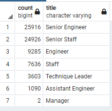
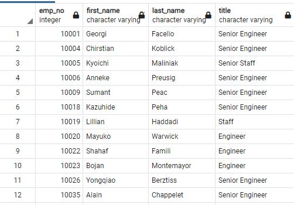
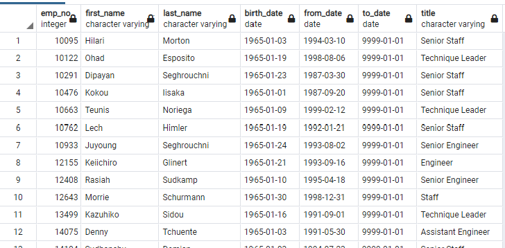

# Pewlett-Hackard-Analysis

## Overview

As an employee for Pewlett Hackard, I am tasked with reviewing employee data to establish how many employees are retiring according to each job title and establish who qualifies to be involved in mentorship. These reports will help the company to effectively prepare for all of the upcoming retirements. 

## Results

* The image below shows that senior roles are understandably the closest to their retirement. 

* The following query results confirm that there will be many staff and engineering positions that need to be filled. 

* Fortunately, it appears that there are a great amount of employees within these positions who are eligible to mentor their successors.  

* There is an appropriate ratio for the positions that will soon need to be filled and people available for the preparations.  

## Summary

### Roles to Be Filled
Engineering and staff positions should be prioritized seeing that 25,916 senior engineer and 24,926 senior staff positions will soon be changing. 

### Mentorship Potential
The mentorship eligibility analysis indicates that there are enough senior workers to guide their juniors. 

### Additional Analyses
It would be beneficial to analyze the salaries of the retiring employees along with the future salaries of their trainees for financial insight. Further research can also be done to investigate the gender split of the retiring employees to ensure that Pewlett-Hackard will be maintaining its diversity as the next generation of employees are ushered in.
